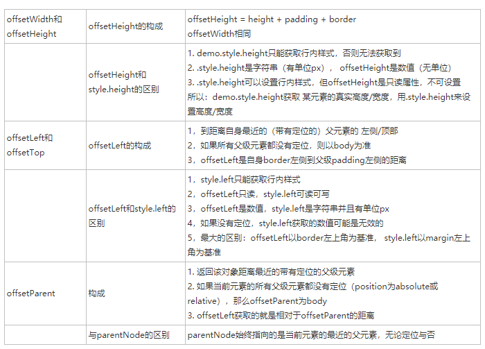
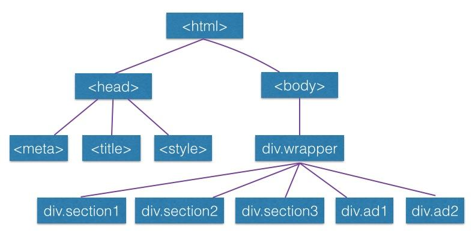

# 2017-2018 Web前端学员第四次上课		

# DOM & BOM

课堂目标:让你们对DOM和BOM有一个基本的认识，并学会简单地操作DOM

## BOM

* 概述

  首先我们来了解一下BOM

  BOM **全称浏览器对象模型**  (Browser Object Model)

  BOM提供了独立于内容，而与浏览器窗口进行交互的对象

  这句话的意思就是，要在Web中使用JavaScript或者其他脚本语言，BOM是其**基础和核心**	

  下图是BOM对象的结构，可以看到，BOM对象包含了window对象、location对象、	navigator对象、screen对象、history对象。

  BOM包含了稍后要讲的DOM


* **window对象** 

  由于BOM主要用于管理窗口与窗口之间的通讯，因此其核心对象是window

  window对象可以理解成你打开的浏览器窗口

  同时，它又是ECMAScript规定的Global对象

  所以所有定义在**全局作用域**中的变量、函数都会变成window对象的属性和方法，在调用的时候可以省略window

  * window对象能干什么

    * document对象，frames对象，history对象...上图的对象全是它的子对象

    * window对象带了很多方法

      比如最简单的alert()方法，还有大家喜闻乐见的console.log()

  * window对象下的一些方法

    * **定时器**

      setInterval()

      setTimeout()

      ```javascript
      setInterval(function (arg){
        // some code....
      },time)
      //定时执行 重复
      setTimeout(function (arg){
        // some code....
      },time)
      //延时执行 不重复
      ```

      ​

    * offset系列

      

    * scroll系列

      scroll顾名思义，是用在滚动框的方法

      scrollHeight , scrollWidth : 指对象实际内容的高宽（不包含broder）

      scrollLeft， scrollTop : 被卷去部分的宽度，高度

      

      ​

      ​		

      ​

    * client系列

      clientX和clientY     获取鼠标在可视区域的位置 

      clientWidth 和 clientHeight 对象可见高宽（不包含滚动条等边线） 

      clientLeft     边框的宽度，若有滚动条的话，包括滚动条

      然后这是一张强无敌的集成上面精髓的图

      我觉得不错，有什么不懂的忘了的就拿这张图一看


* location对象

  提供了和当前窗口加载的文档有关的信息，甚至可以导航

* screen对象

  有表明客户端的能力，一般用不到

* navigator对象

  拿来识别客户端浏览器

* history对象

  用过跳转吗 history.go()

  ​

## DOM

文档对象模型（Document Object Model，简称DOM），是[W3C](https://baike.baidu.com/item/W3C)组织推荐的处理可扩展标志语言的标准编程接口。在网页上，组织页面（或文档）的对象被组织在一个树形结构中，用来表示文档中对象的标准模型就称为DOM。Document Object Model的历史可以追溯至1990年代后期微软与[Netscape](https://baike.baidu.com/item/Netscape)的“浏览器大战”，双方为了在[JavaScript](https://baike.baidu.com/item/JavaScript)与[JScript](https://baike.baidu.com/item/JScript)一决生死，于是大规模的赋予浏览器强大的功能。微软在网页技术上加入了不少专属事物，既有[VBScript](https://baike.baidu.com/item/VBScript)、[ActiveX](https://baike.baidu.com/item/ActiveX)、以及微软自家的[DHTML](https://baike.baidu.com/item/DHTML)格式等，使不少网页使用非微软平台及浏览器无法正常显示。DOM即是当时蕴酿出来的杰作。

* **节点层次（DOM树）**

  * 首先给一个直观的印象

    

  这就是DOM树了,但是这张图并不能展现所有的节点

  * 节点类型

    ​

    **元素节点            　　Node.ELEMENT_NODE(1)**
    **属性节点            　　Node.ATTRIBUTE_NODE(2)**
    **文本节点            　　Node.TEXT_NODE(3)**
    *CDATA节点             Node.CDATA_SECTION_NODE(4)*
    *实体引用名称节点    　　 Node.ENTRY_REFERENCE_NODE(5)*
    实体名称节点        　　Node.ENTITY_NODE(6)
    处理指令节点        　　Node.PROCESSING_INSTRUCTION_NODE(7)
    注释节点            　 Node.COMMENT_NODE(8)
    **文档节点            　 Node.DOCUMENT_NODE(9)**
    文档类型节点        　　Node.DOCUMENT_TYPE_NODE(10)
    文档片段节点        　　Node.DOCUMENT_FRAGMENT_NODE(11)
    DTD声明节点            Node.NOTATION_NODE(12)

    ​

    * 文档节点（Document类型）

      表示文档，浏览器中表示整个页面，是window对象的一个属性

      ​

    * **元素节点** （Element类型）

      对应网页的HTML标签元素，所以HTML元素都是HTMLElement类型

      提供对元素表签名，子节点和特性的访问

      * 标准特性（所有元素都有）

        **id** ：元素唯一标识符

        **className** ：代表元素css类

        title ：有关元素附加说明信息

        *lang* ：元素内容语言代码

        *dir*  ：语言的方向

    * 文本节点 （Text类型）

      包含可以照字面解释的纯文本内容，可以包含转义后的HTML字符

      （就是纯文本）

      * 空格也算文本节点
      * **回车也会产生文本节点** （记住左边这句话，前人翻车，后人呵呵）

  * **节点关系**

    节点之间的关系可以用传统的家族关系来描述，DOM树就是你的家谱

    - 父子节点

      例子： \<body> 元素是\<html>元素的子节点

      ​	\<html>元素是\<body>元素的父节点

      被包含在一个DOM节点内的节点可以称为该节点的子节点

      仅有一层父子关系的元素称为 直接父\子元素

    - 兄弟节点

      例子：\<head>元素是\<body>元素的兄弟节点

      同属于一个父节点，且相互无父子关系的节点是兄弟节点

  * **基本节点操作**  

    **现在来到重点** 

    * 节点获取

      ```javascript
      var newNode1 = document.getElementById();
      //根据元素id获取元素
      var newNode2 = document.getElementByClassName();
      //根据元素class获取元素
      var newType1 = document.querySelector();
      var newType2 = document.querySelectorAll();
      //API拓展的获取元素方法，建议使用
      MyElement.firstChild;
      MyElement.lastChild;
      MyElement.childNodes[0];
      //获取子节点
      MyElement.parentNode;
      //获取父节点
      ```

    * 节点创建

      ```javascript
      var newdiv = document.createElement("div");
      //创建一个div
      var newtext = document.createTextNode("Hello World!");
      //创建一个文本节点，内容为Hello World！
      ```

    * 取得特性

      每个元素都有一个或多个特性

      ```javascript
      //接上
      var El = document.querySelector(".myDiv");
      console.log(El.getAttribute("classname"));
      //获取id并打印在控制台
      但是很多简单属性可以不使用这个方法
      我们使用点操作符
      console.log(El.className)
      ```

    * 设置特性

      ```javascript
      //接上
      El.setAttribute("classname","yourDiv");
      //设置El的classname为"yourDiv"
      显然我们还是不用
      我们又使用点操作符
      El.className = "yourDiv";
      ```

    * 创（qin）造（ding）特性

      ```javascript
      var attr = createAttribute("index");
      El.setAttributeNode(attr);
      ```

      ​

    * 设置CSS

      这里和特性设置有一些不同，因为JavaScript设置css样式全部都设置到内联样式表

      既style特性中，所以设置css属性需要如下操作

      ```javascript
      //接上
      El.style.height = 100 + "px";
      //设置El的高度为100px;
      //注意：记得带上单位
      background-posistion
      ```

      注意：点操作符操作css的写法和css写法略有不同

      [这里有部分对照，没有的直接百度](http://blog.csdn.net/yuwq123/article/details/52767064)

      或者使用style['background-posistion']

      比如

      ```javascript
      El.style['background-color'] = "red";
      ```

      ​

    * **添加\删除节点**

      ```javascript
      //接上
      El.appendChild(newdiv);
      //把newdiv加到El节点的末尾
      El.parentNode.insertBefore(newdiv,El);
      //把newdiv插到El前面
      El.parentNode.removeChild(newdiv);
      El.parentNode.removeChild(El.lastChild);
      //删除节点
      ```

      ​

  注：全文黑体为重要部分，倾斜为次（bu）要（kan）部分

  [上课用的demo](./demo.html)

  ​

