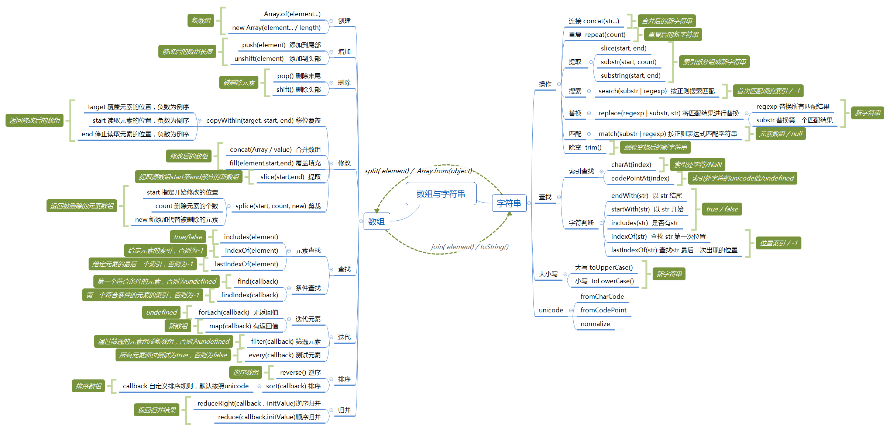
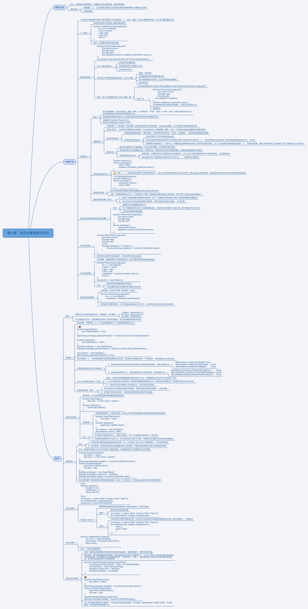

## 数组与字符串

​    “想知道[‘llp’, 'pbb','aab']中有没有‘llp’呢”

​    “才学了for循环，美滋滋”

​    “只要数组中大于10的值，怎么办呢？” 

​    “又是数组，for一把梭”

​    “判断'abcdddddd'中有没有‘d’，怎么办呢？” 

​    “字符串好像也可以像数组那样一个个取出来呢，虽然有点麻烦，一个个试吧”

​    “判断'adadadada'中是否有'ad'，一个个取出来也没用了呢，怎么办呢？"

​    难受，编不下去了

​   

​       API大礼包



### 数组

##### => 字符串

+ join(element)

  + 参数  element: 用于连接数组各值之间的元素，拼接成一个字符串

  ```
  x = [1,2,3,'xi','heh']

  x.join('o') // '1o2o3oxioheh'
  ```

+ toString()

  + 直接将数组各元素拼接成字符串

  ```
  x = [1,2,3,4];
  x.toString()  // '1234'
  ```

  ​

#####     创建

```
//Array.of(element...)  类静态方法

let x = Array.of(1,2,3,4,5);//[1,2,3,4,5]

//new Array(element... / length) 构造器方法

let x = new Array(1,2,3,4,5)//[1,2,3,4,5]

x = new Array(5)//[ , , , , ,]
```


##### 增加

```
// arr.push(element) 添加到数组尾部
x.push(1)// 6

// arr.unshift(element) 添加到数组头部
x.unshift(2) // 7
```


##### 删除

```
//arr.pop() 删除最后一个元素
x.pop() // 5

//arr.shift() 删除第一个元素
x.shift() //1
```


##### 修改

+ 移位覆盖      arr.copyWithin(target, start, end)

  + target: 被覆盖部分的起始位置，负数为倒序

  + start: 用于移位的部分的起始位置，负数为倒序

  + end: 用于移位的部分的结束位置，但不包括该位置，负数为倒序

  返回值：修改后的原数组

  ```
  x.copyWithin(1,2,4)//   [1,3,4,4,5]

  x.copyWithin(1,-2,0)//  [1,3,4,4,5]

  x.copyWithin(1,-2,-1)// [1,4,4,4,5]
  ```


+ 合并数组        arr.concat(array / value)

  + 参数

    array   其他数组

    value   一个元素

  + 返回值 ：一个新的数组，并非添加到原数组上

  ```
  let y = [5,4,3,2,1]

  x.concat(y) // [1,2,3,4,5,5,4,3,2,1]

  x.concat(6) //[1,2,3,4,5,6]
  ```

  ​

+ 覆盖填充        fill(element, start, end)

  + 参数
    + element:  用于填充数组的元素
    + start: 填充端的起始位置，负数为倒序
    + end: 填充端的结束位置，但不包括该位置，负数为倒序
  + 返回值：修改后的原数组

  ```
  x.fill(6,2,5) // [1,6,6,6,5]
  ```

  ​

+ 提取        slice(start, end)

  + 参数
    + start: 从当前位置开始提取
    + end: 提取到该位置结束，但不包括该位置
  + 返回值： 提取部分元素组成的新数组

  ```
  x.slice(2,4) // [3,4]
  ```

  ​

+ 剪裁        splice(start, count, new)

  + 参数
    + start:  指定开始修改的位置
    + count:  删除元素的个数
    + new:  用于代替被删除元素的值
  + 返回值： 被删除元素组成的数组

  ```
  x.splice(2, 2) //[3,4]
                 // x: [1,2,5]

  x.splice(2,3,1) // [3,4,5]
                  // x: [1,2,1,1,1]
  ```

  ​

##### 查找

+ 元素查找
  + includes(element)

    + 参数
      + element: 需要查找的元素
    + 返回值    存在目标元素—true /  没有目标元素—false

    ```
    x.includes(2)  // true

    x.includes(7)  // false
    ```

  + indexOf(element)

    + 参数
      + element: 需要查找的元素
    + 返回值    第一个目标元素的索引值，没有目标元素则为-1

    ```
    x = [1,2,3,2,1]

    x.indexOf(3)  // 2

    x.indexOf(7)  // -1
    ```

  + lastIndexOf(element)

    + 参数
      + element: 需要查找的元素
    + 返回值    最后一个目标元素的索引值， 没有目标则为-1
    ```
    x = [1,2,3,2,1]

    x.lastIndexOf(2) // 3
    ```

+ 条件查找
  + find(callback)

    + 参数
      + callback(element, index, array) 回调函数
        + element: 当前遍历到的元素
        + index: 当前元素的索引
        + array: 数组本身
    + 返回值    第一个符合条件的元素值，否则为undefined

    ```
    x.find((ele, i) => {
        if (ele > 4) {
            console.log(i);
        }
    })  // 5
    ```

    ​

  + findindex(callback)

    + 参数  
      + callback(element, index, array)  同find

    + 返回值    第一个符合条件的元素的索引值，否则为-1

    ```
    x.find((ele, i) => {
        if (ele > 4) {
            console.log(i);
        }
    })  // 4
    ```


##### 迭代

+ 迭代元素
  + forEach(callback)

    + 参数  callback(element, index, array)  同find 
    + 返回值    undefined

    ```
    x.forEach((ele, i) => {
        console.log(i, ele)
        // return ele * 2
    }) //undefined
    ```

  + map(callback)

    + 参数callback  同上
    + 返回值   尽回调处理后的新数组

    ```
    x.map((ele, i) => {
        if (ele > 2 && ele < 5) {
            return  ele * 2
        } else {
            return ele
        }
    }) // [1,2,6,8,5]
    ```

+ 筛选元素   arr.filter(callback)

  + 参数 callback(element, index, array)同上
  + 返回值    符合条件的元素组成新数组，否则为undefined

  ```
  x.filter((ele, i) => {
      return ele > 2 && ele < 5
  }) // [3,4]
  ```

+ 测试元素    arr.every(callback)

  + 参数 callback(element, index, array) 同上
  + 返回值    当所有元素通过回调测试，为true, 否则为false

  ```
  x.every((ele, i) => {
      return  ele > 7
  }) // false
  ```

##### 排序

+ 逆序   arr.reverse()

  + 参数  无
  + 返回值  逆序后的原数组

  ```
  x.reverse() // [5,4,3,2,1]
  ```

+ 排序  arr.sort(callback)

  + 参数  默认将各个元素按照unicode进行排序
    + 可选  callback(a,b)  a,b用于比较的前后两个元素
  + 返回值  原数组排序

  ```
  x = [1,3,2,4,5]
  y = x.sort((a,b) => {
      console.log(a,b);
      return a-b
  });
  console.log(y); // [1,2,3,4,5]
  console.log(x) // [1,2,3,4,5]
  ```

##### 归并

+ 顺序归并  reduce(callback, initValue)

  + 参数
    + callback(value, element) 
      + element  当前元素
      + value 当前元素之前的累积值
    + initValue  用于累积的初始值，默认为数组第一个元素
  + 返回值    数组遍历后的最终累积值

  ```
  x.reduce((value, ele) => {
      return ele + value
  }) // 15
  x = ['aaaa', 'bbbbb', 'ccccc']
  x.reduce((value, ele) => {
      return value.concat(ele)
  }) //
  ```

+ 逆序归并  reduceRight(callback, initValue)

  + 使用同reduce, 只是从最后一个元素开始向前遍历

### 字符串

##### =>数组

+ split(element)

  + 参数
    + element:  将字符串中以element为界分割成几个小字符串
  + 返回值  小字符串组成的数组

  ```
  x = 'redrock'

  x.split('r') // ['', 'ed', 'ock']
  ```

+ Array.from(object)

  + 该函数是将类数组对象转换为数组，所以参数为object
  + 类数组对象：键名为正整数，有length
  + 字符串是一种类数组对象

##### 操作

+ 连接        concat(str...)

  + 参数
    + str... :  用于连接的字符串，可以多个
  + 返回值  拼接后的新字符串

  ```
  let x = 'redrock';

  x.concat('er', '_bi~') //'redrocker_bi~'
  ```

+ 重复        repeat(count)

  + 参数

    count: 重复次数

  + 返回值 原字符串重复count次后拼接成的新字符串

  ```
  x.repeat(3) // 'redrockredrockredrock'
  ```

+ 提取
  + slice(start, end)

    + 参数

      + start  目标段开始的索引值

      + end   目标段结束的的索引值+1 

  + 返回值    目标段字符串

    ```
    x.slice(2,5) // 'dro'
    ```

  + substr(start, count)

    + 参数
      + start  需要提取的字符串的开始位置
      + count   从start起需要提前的字符数 
    + 返回值    目标段字符串

    ```
    x.substr(2,3)// 'dro'
    ```

  + substring(start, end)    同slice  ,但不支持负数索引

+ 除空        trim()   删除原字符串中的空格，作为新字符串返回

  + 返回值  删除空格后的新字符串

+ 匹配        match(substr | regexp) 

  + 参数

    + substr: 需要匹配的字符串
    + regexp: 正则匹配表达式

  + 返回值    使用字符串匹配时返回第一个匹配元素的索引数组

    ​                使用正则匹配时返回所有匹配元素的集合数组

  ```
  x = 'dsb,ssb,sb,b'

  x.match('sb') // [ 'sb', index: 1, input: 'dsb,ssb,sb,b' ]

  x.match(/sb/gi) // ['sb', 'sb', 'sb']
  ```

+ 搜索        search(substr | regexp)

  + 使用同match,只是无论使用substr还是regexp，都只返回第一个匹配元素的索引值

+ 替换        replace(substr | regexp, str)

  + 参数 substr, regexp同上

  + 返回值   substr时，只匹配替换第一个元素

    ​               regexp时，替换所有符合匹配的元素

    ​               替换后的字符串作为新字符串返回

  ```
  x = 'dsb,ssb,sb,b'

  x.replace('sb', 'llp') // 'dllp,ssb,sb,b';

  x.replace(/sb/gi, 'llp') // 'dllp,sllp,llp,b'; 
  ```

##### 查找

+ 索引查找
  + charAt(index)

    + 参数
      + index 索引值
    + 返回值  索引处字符，没有目标则为NaN

    ```
    x = 'redrock'
    x.charAt(5) // 'c'
    x.charAt(11) // NaN
    ```

  + codePointAt(index)

    + 参数
      + index 索引值
    + 返回值  索引出字符的unicode值，没有目标则为NaN

    ```
    x = 'redrock'
    x.codePointAt(5) // 99
    x.codePointAt(11) // NaN
    ```
+ 字符判断
  + endWith(str)   原字符串是否以str结束

    + 参数
      + str: 搜索目标字符串
    + 返回值  true/false

    ```
    x = 'redrock'
    x.endWith('k')  // true
    x.endWith('x')  // false
    ```

  + startWith(str)   原字符串是否以str开始

    + 同endWith

  + includes(str)  原字符串是否有str

    + 同endWith

  + indexOf(str)   查找str第一次出现的位置（是否有str）

    + 返回值： 目标str第一次出现的位置索引，没有则为-1

    ```
    x = 'redrocker'
    x.indexOf('rock') // 3
    x.indexOf('rok')  //-1
    ```

  + lastIndexOf(str)

    + 查找str最后一次出现的位置
    + 使用同indexOf

##### 大小写

+ 大写        toUpperCase()
  + 将目标字符串全部转为大写，作为新字符串返回，不修改原字符串
+ 小写        toLowerCase()
  + 将目标字符串全部转为小写，作为新字符串返回，不修改原字符串

## 面向对象

> 将你的需求抽象成一个对象，然后针对这个对象分析其特征与动作

[一句话介绍](https://www.zhihu.com/question/19854505)

1. 抽象

   ##### 面向过程与面向对象

   外卖小哥今天业务繁忙，需要送很多单

   面向过程：来一单，接到就走，一单一单的送

   面向对象：拿个大背包，接半个小时的单一起送

2. 封装

   代码层面用对象将外卖和背包表示出来

   有很多外卖，但每个外卖名字，价格，内容都不同，怎么办呢，我们就要先封装一个外卖类

   ```
   function FastFood(name, price, food) {

   	this.name = name;
   	this.price = price;
   	this.food = food;
   	
   	this.setName = function () {}

   }

   FastFood.prototype.info = function () {
   	console.log(this)
   }

   ```

   为什么info函数不放在构造函数里面呢，反而放在外面，这样能执行吗？

   通过this添加的属性，方法，是在当前对象上添加的

   通过原型添加的，并不属于当前对象自身的，使用时，需要通过原型链去查找

   简单的说，每次通过类创建一个新对象时，使用this会新建属性和方法，会占用新的内存空间，而使用原型链的话，不会占用新的内存空间，他只需要去原型链上找到原型方法所在的内存空间就可以使用

   现在我们有了一个简单的外卖类了，但我的包好像只能装30个外卖，我想让他在装满的时候，就不要再制作外卖了，但是别把我装了多少透露出去，我该怎么办呢

   ```
   var FastFood = (function () {
   	var num = 0;

   	function fastfood(name, price, food) {

   		this.name = name;
   		this.price = price;
   		this.food = food;

   		if (num < 30) {
   			num ++;
   		} else {
   			throw new Error('装不下了，下一波吧')
   		}

   		this.setName = function () {}
   	}

   	fastfood.over = false;

   	fastfood.prototype = {
   		isBad:  false,
   		info: function () {}
   	}
   	return fastfood
   })();
   ```

   到了这里，我们可以将类分为3个部分

   + 构造函数内，用于对象复制
   + 构造函数外，原型链上，供实例对象使用
   + 构造函数外，不在原型链上，供类使用，实例不可使用

3. 继承

   在上面，类的三大组成中之二，构造函数外，原型链上。放置在原型链上的，供实例对象使用。

   ```
   function hmj() {
   	this.food = ['鸡'];
   }

   function fastfood(name, price) {}

   fastfood.prototype = new hmj();
   var wxj = new fastfood('hmj',15);
   var fyj = new fastfood('hmj', 16);
   hmj2.food.push('香菇');
   console.log(hmj1.food);
   console.log(hmj2.food)
   ```

   子类实现的继承是靠其原型prototype对父类的实例化实现的，因此，在创建父类时，是无法传参的，那么就无法对父类构造函数内的属性进行初始化。

   + 构造函数继承

   ```
     function hmj() {
     	this.food = ['鸡'];
     }
    
     function fastfood(name, price) {
     	hmj.call(this, name)
     }
     var hmj1 = new fastfood('hmj',15);
     var hmj2 = new fastfood('hmj', 16);
     hmj2.food.push('香菇');
     console.log(hmj1.food);
     console.log(hmj2.food)
   ```

   + 组合继承

   ```
     function hmj() {
     	this.food = ['鸡'];
     	this.score = 10;
     }

     function fastfood(name, price) {
     	hmj.call(this, name)
     }
     fastfood.prototype = new hmj()

     var hmj1 = new fastfood('hmj',15);
     var hmj2 = new fastfood('hmj', 16);
     hmj2.food.push('香菇');
     console.log(hmj1.score);
     console.log(hmj2.score)
   ```

   + 寄生组合继承

   ```
     function heritObj(obj) {
     	function F() {}
     	F.prototype = o;
     	return F();
     }

     function inHerit(sub, father) {
     	var tp = heritObj(father.prototype);
     	tp.constructor = sub;
     	sub.prototype = tp;
     }
   ```

     ​

4. 多态

   还是刚才那个外卖的列子，有些外卖只写了重庆邮电大学，有些呢有楼栋号，有些呢还有楼层号，房间号，这个怎么办呢。我们就需要针对不同的地方做不同的处理

   ```
   function FastFood() {

   	this.go = function () {
   		var arg = arguments;

   		switch(arg.length) {
   			case 1: {
   				//送到重庆邮电大学中心食堂
   			}
   			case 2: {
   				//送到楼栋底楼，打电话下来取
   			}
   			case 3: {
   				// 送到房间
   			}
   			default: {
   				//打电话询问商家，送到哪
   			}
   		}
   	}
   }
   ```

   ​

   推荐：[JavaScript设计模式](http://download.csdn.net/download/pad12270828/9660273)

   ​           [彻底理解JS面向对象编程](https://github.com/oakland/Native-JS-Practice/blob/master/11-learnOOPfromCircles.js/0-%E5%BD%BB%E5%BA%95%E7%90%86%E8%A7%A3JS%E4%B8%AD%E9%9D%A2%E5%90%91%E5%AF%B9%E8%B1%A1%EF%BC%88%E5%89%8D%E8%A8%80%EF%BC%89.md)

   

